# **Shark Attack**

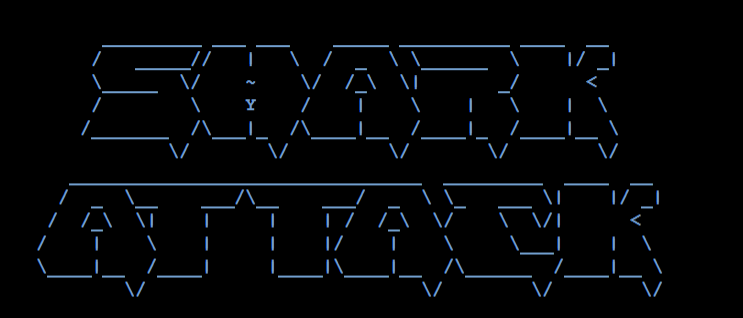

## **Introduction**

Shark Attack is a fun spin on the traditional Hangman game. The player must save the individual before the shark attacks them fatally! Before game commencement, the user has the option of seeing the game rules. The user then selects one of three difficulty levels. To win the game, the user must solve the hidden word before the lives counter reaches 0 and each letter made will be noted. Whether the user wins or loses, the last prompt of the game allows the user to play again or return to the start menu.

Click [here](https://shark-attack.herokuapp.com/) to access the game's final deployment.

## **Shark Attack Flowchart**

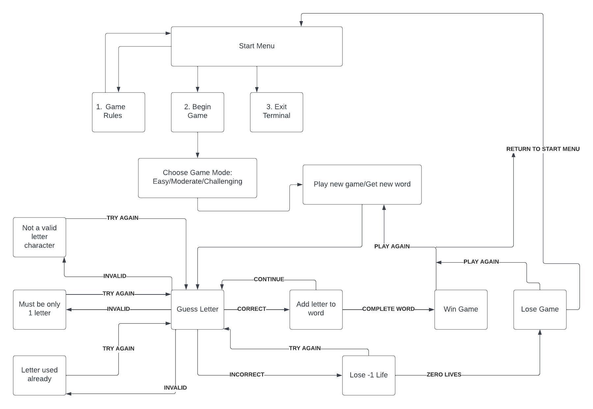

- This was the logic flowchart that was created to construct the Shark Attack game.
- All of the elements of the plan have been effectively implemented and tested.
- The user will have a seamless gameplay experience with no broken logic.

## **Features**

### **Start Menu**

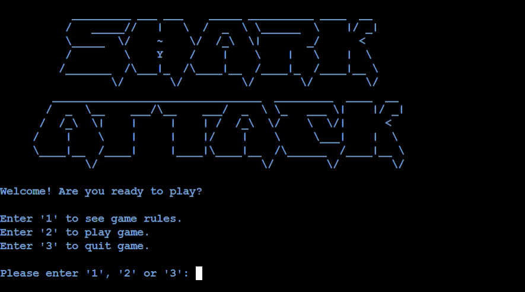

- The start menu features the game logo as well as three choices.
- "1" to view the game rules for users who are not acquainted with how the game works.
- "2" to initiate the game.
- "3" to exit the game.
- The color of the game terminal was changed to bright blue since it is most fitting for ocean colors.

### **Game Rules**

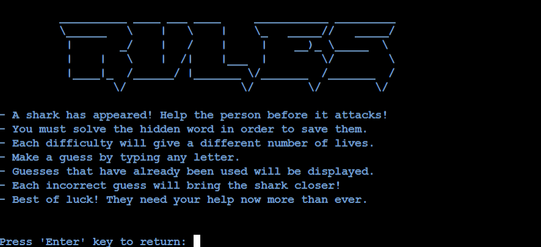

- The user chose option "1" from the start menu.
- The rules page features an ASCII graphic and a structured list of the game rules.
- The user will be requested to hit the "Enter" key to exit the game rules page and return to the start menu.

### **Game Difficulty Selection**

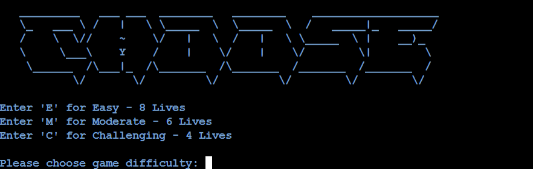

- The user chose option "2" from the start menu.
- The game difficulty selection features an ASCII graphic and three game modes.
- 'E' indicates Easy and offers the user 8 lives.
- 'M' indicates Moderate and offers 6 lives.
- 'C' indicates Challenging and challenges the user's problem-solving skills by granting just 4 lives.
- The user will be requested to enter "E", "M" or "C" to continue the game.

### **Game Commenced**

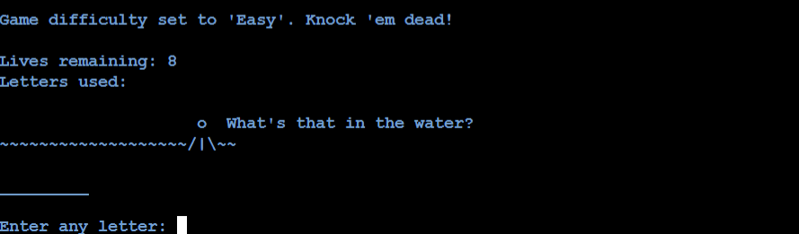
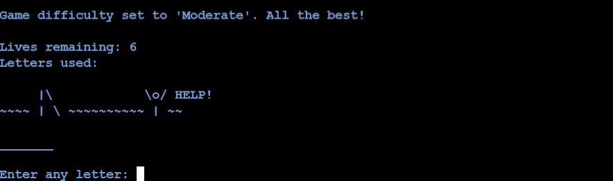
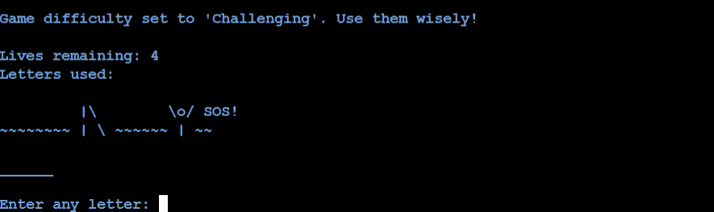

- The shark phases graphic will depict the stage that corresponds to the amount of lives the user has.
- Each guess attempt/letter used will be displayed, along with the number of lives left.
- The hidden word is also included, however for the purpose of the game, each letter is replaced with an underscore, "_".

### **Invalid Inputs**

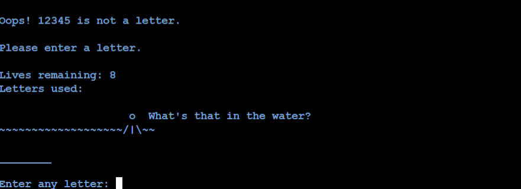

- The user will be alerted with a message informing them that their recent input was not a desired letter character.
- The user will be prompted to enter a valid letter character.

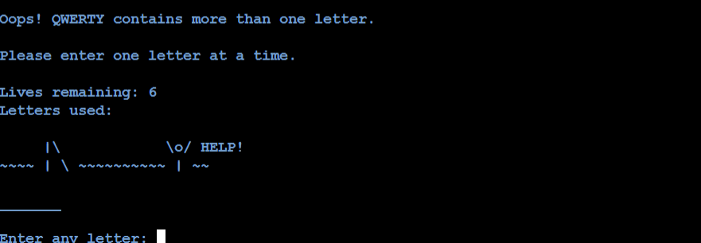

- The user will be alerted with a message informing them that their recent input contained more than 1 letter character.
- The user will be prompted to enter one letter at a time.

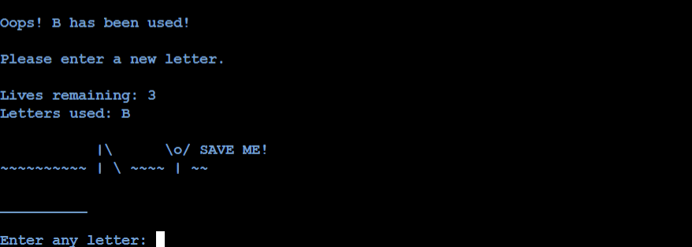

- The user will be alerted with a message informing them that their recent input has already been used.
- The user will be prompted to enter a new letter.

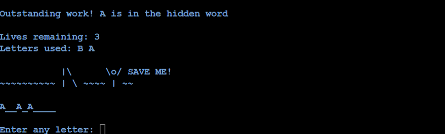

- The "Letters used" list will be updated with the correct guess.
- The position of the guess inside the hidden word will be revealed.
- The same shark phases graphic will be displayed along with the number of lives left.
- The game continues until either the hidden word is completely revealed or all lives are depleted.

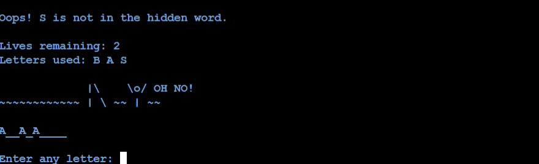

- A new shark phases graphic will appear, indicating that the user is on the verge of losing the game.
- The number of lives remaining will be reduced by one.
- No changes will be made to the hidden word.
- The game continues until either the hidden word is completely revealed or all lives are depleted.

### **End Game Messages**

- When the hidden word is completely revealed, a new shark phases image is displayed showing that the user has successfully saved the individul from the shark.
- "YOU WIN!" will be shown in ASCII art.
- The user is then given the option of playing again by entering "Y" or returning to the start menu by entering "N".

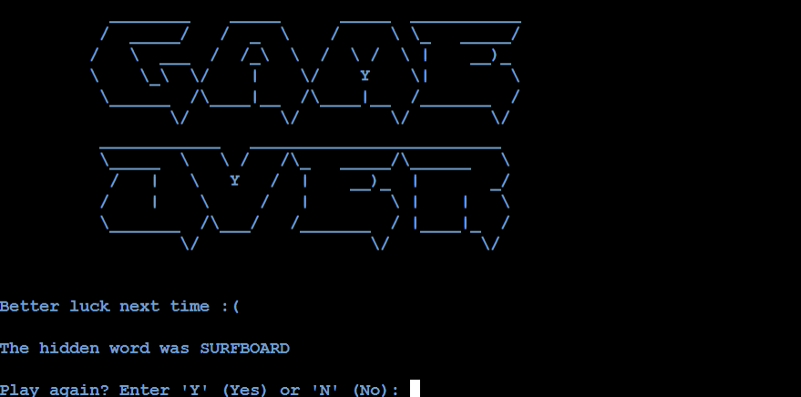

- When all lives are depleted, a new shark phases image is displayed showing that the user failed to save the individul from the shark and the shark gets a delicious dinner.
- "GAME OVER" will be shown in ASCII art and the hidden word will be revealed.
- The user is then given the option of playing again by entering "Y" or returning to the start menu by entering "N".