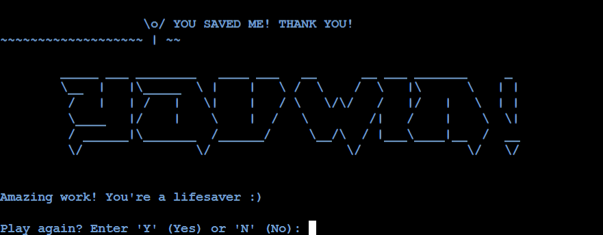

# **Shark Attack**

## **Introduction**

Shark Attack is a fun spin on the traditional Hangman game. The player must save the individual before the shark attacks them fatally! Before game commencement, the user has the option of seeing the game rules. The user then selects one of three difficulty levels. To win the game, the user must solve the hidden word before the lives counter reaches 0 and each letter made will be noted. Whether the user wins or loses, the last prompt of the game allows the user to play again or return to the start menu.

Click [here](https://shark-attack.herokuapp.com/) to access the game's final deployment.

## **Shark Attack Flowchart**

- This was the logic flowchart that was created to construct the Shark Attack game.
- All of the elements of the plan have been effectively implemented and tested.
- The user will have a seamless gameplay experience with no broken logic.

## **Features**

### **Start Menu**

- The start menu features the game logo as well as three choices.
- "1" to view the game rules for users who are not acquainted with how the game works.
- "2" to initiate the game.
- "3" to exit the game.
- The color of the game terminal was changed to bright blue since it is most fitting for ocean colors.

### **Game Rules**

- The user chose option "1" from the start menu.
- The rules page features an ASCII graphic and a structured list of the game rules.
- The user will be requested to hit the "Enter" key to exit the game rules page and return to the start menu.

### **Game Difficulty Selection**

- The user chose option "2" from the start menu.
- The game difficulty selection features an ASCII graphic and three game modes.
- 'E' indicates Easy and offers the user 8 lives.
- 'M' indicates Moderate and offers 6 lives.
- 'C' indicates Challenging and challenges the user's problem-solving skills by granting just 4 lives.
- The user will be requested to enter "E", "M" or "C" to continue the game.

### **Game Commenced**

- The shark phases graphic will depict the stage that corresponds to the amount of lives the user has.
- Each guess attempt/letter used will be displayed, along with the number of lives left.
- The hidden word is also included, however for the purpose of the game, each letter is replaced with an underscore, "_".

### **Invalid Inputs**

- The user will be alerted with a message informing them that their recent input was not a desired letter character.
- The user will be prompted to enter a valid letter character.

- The user will be alerted with a message informing them that their recent input contained more than 1 letter character.
- The user will be prompted to enter one letter at a time.

- The user will be alerted with a message informing them that their recent input has already been used.
- The user will be prompted to enter a new letter.

- The "Letters used" list will be updated with the correct guess.
- The position of the guess inside the hidden word will be revealed.
- The same shark phases graphic will be displayed along with the number of lives left.
- The game continues until either the hidden word is completely revealed or all lives are depleted.

- A new shark phases graphic will appear, indicating that the user is on the verge of losing the game.
- The number of lives remaining will be reduced by one.
- No changes will be made to the hidden word.
- The game continues until either the hidden word is completely revealed or all lives are depleted.

### **End Game Messages**

- When the hidden word is completely revealed, a new shark phases image is displayed showing that the user has successfully saved the individul from the shark.
- "YOU WIN!" will be shown in ASCII art.
- The user is then given the option of playing again by entering "Y" or returning to the start menu by entering "N".

- When all lives are depleted, a new shark phases image is displayed showing that the user failed to save the individul from the shark and the shark gets a delicious dinner.
- "GAME OVER" will be shown in ASCII art and the hidden word will be revealed.
- The user is then given the option of playing again by entering "Y" or returning to the start menu by entering "N".

## **Testing Phase**

### **CI Python Linter Testing**

- The run.py and words.py files were tested and passed for most. 
- However, multiple errors named "invalid escape sequence" and "continuation line missing indentation or outdented" were present.
- It was discovered that the errors appeared due to the shark phases ASCII art that I solely created.
- My mentor confirmed with me that the errors shown above can be ignored.

### **Manual Testing**

- Implementation: At the start menu, the user has options "1", "2" or "3".
- Test: I entered the options and they worked seamlessly, redirecting me to the correct stage. I also attempted to input other numbers and letter characters.
- Result: Only "1", "2" or "3" inputs will be accepted and will reject any other invalid input.

- Implementation: At the rules page, the user only has one option which is the "Enter" key to return to the start menu.
- Test: I tried entering other numbers, letters and special characters but they did not work. The "Enter" key functioned appropriately.
- Result: Only "Enter" key will bring the user out of the rules page and will reject any other invalid input.

- Implementation: At the game difficulty selection, the user has options "E", "M" or "C".
- Test: I typed the desired options above and each one successfully brought me to the appropriate next stage. I attempted to input numbers or other letters and all of my attempts failed.
- Result: Only "E", "M" or "C" inputs will be accepted and will reject any other invalid input.

- Implementation: To ensure that the user input is not a number but a letter.
- Test: I entered a number and it failed immediately.
- Result: Only letter character inputs will be accepted in the terminal.

- Implementation: To ensure that the user input does not contain more than one letter.
- Test: I entered multiple letter combinations e.g "QWERTY", "ASAP", "GG" and all of them were rejected.
- Result: The game will only accept a single letter one at a time.

- Implementation: To ensure that the user cannot use a previous letter.
- Test: I typed in a single letter which was not in the hidden word. It was then added to the list of letters used. When I tried to input the same letter, I was given a message that it has already been used. I tested another letter that was actually in the hidden word and tried to input it again and the same results occured.
- Result: The game will inform you if you have used a previous letter and will not allow it to be used again.

- Implementation: To ensure that when the user wins or loses the game, the appropriate graphics will be displayed.
- Test: I played the game to win and lose once and I got the desired graphic.
- Result: A game win will show the win message and a game lose will show the lose message.

## **Bugs**

- Shark_phases function issue, code failed to work as the function was called within the new_game function before defining it. 
FIXED by moving the shark_phases definition above the new_game function.

- Shark_phases function issue, did not return any value and as a result, the number of lives did not correspond to the number of shark phases.
FIXED by adding the appropriate return statement and indexing into the phases list using the number of lives as the index.

Mentor advice that was used: 
- Migrate ASCII art into the same file where the word list is.
- Implementing a game difficulty selection function.
- Add break and continue statements to avoid infinite while loops.

## **Deployment**

1. Upload your code to GitHub.
2. Log in or sign up for Heroku and build a new app.
3. Choose a distinct name.
4. In the settings tab, show the configuration variables; for this project, one was required following Code Institute guidelines.
5. Enter PORT for KEY and 8000 for VALUE, then click add.
6. Click Add Buildpack, pick Python, and save.
7. Click Add Buildpack again, this time selecting Nodejs, and then save.
8. Python should be prioritized above Nodejs in the buildpack list.
9. Navigate to the deploy tab, pick GitHub as the deployment mechanism, and link your GitHub account.
10. When prompted, enter the repository to which you wish to deploy, search for it, and then connect to it.
11. You can now either arrange it to deploy the relevant branch automatically or manually.
    - Deploys the app automatically whenever you post something to GitHub.
    - You have manual control over when the app is deployed, but you must remember to do it.
12. After the app is completed, Heroku will have a link to the live web page.

## **Credits**

- My mentor Richard for the guidance and encouragement.
- [ASCII Art](https://patorjk.com/software/taag/#p=testall&f=3D%20Diagonal&t=Hangman) - ASCII art used in this project.
- [Kite Hangman Youtube Tutorial](https://www.youtube.com/watch?v=m4nEnsavl6w) - Inspiration for the project and using some of its code composition.
-[Shark Phases Art](https://ascii.co.uk/art/stickman) - Inspiration for the shark phases I created.
-[Add color to command line](https://www.lihaoyi.com/post/BuildyourownCommandLinewithANSIescapecodes.htm) - Assisted me in adding color to the terminal.